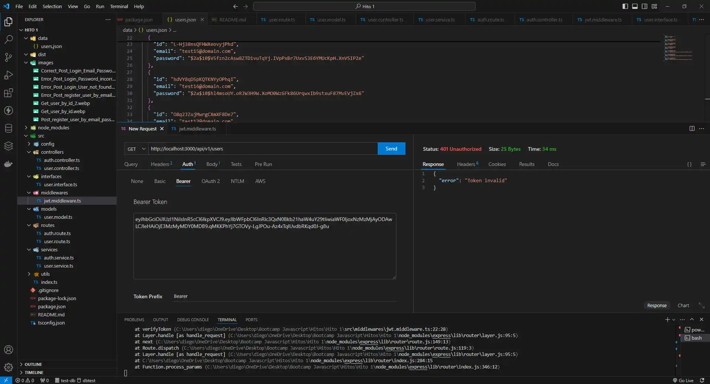

# HITO 2 - Node.js - Express - API
# Hito-2-Backend_Node_y_Express

Proyecto educativo básico "Creación de un servidor" con node y express

ESTA ES LA CONTINUACIÓN DEL REPOSITORIO: https://github.com/DiegoGonzalezBaeza/Hito-1-

# Sistema de Gestión de Base de Datos

- **PostgresSql**: Es un sistema de gestión de bases de datos relacional (RDBMS) de código abierto, robusto y ampliamente utilizado.

Características clave:
Relacional y Orientado a Objetos: Soporta relaciones tradicionales y también características avanzadas como herencia y tipos de datos personalizados.
Consultas Avanzadas: Compatible con SQL estándar y extensiones propias.
Escalabilidad: Ideal para proyectos pequeños y grandes; puede manejar grandes volúmenes de datos.

- **Docker**: Es una plataforma que permite crear, desplegar y ejecutar aplicaciones dentro de contenedores.
¿Qué son los contenedores?
Son entornos ligeros y portátiles que incluyen todo lo necesario para que una aplicación funcione (código, dependencias, librerías, etc.). Son como "máquinas virtuales" pero mucho más eficientes.

Ventajas principales:
Portabilidad: Los contenedores se ejecutan de la misma manera en cualquier entorno, ya sea tu computadora, un servidor, o la nube.
Aislamiento: Cada contenedor es independiente, evitando conflictos entre aplicaciones.
Eficiencia: Consume menos recursos que las máquinas virtuales tradicionales.
Escalabilidad: Facilita la gestión de aplicaciones distribuidas.

# 1.- Instalar node postgres:

Permite conectar el proyecto con la base de datos

```bash
npm install pg
```

# 2.- Extensión PostgreSQL


# 1.- Instalar express:

```bash
npm install express
```

No basta solamente con instalar la dependencia para produccion, si no tambien para developer.

```ts
import express from "express"
```

al escribir el codigo de import, nos mostrar un error en "express", con el cursor encima del problema, visual studio nos dara la solución: 

```bash
npm i --save-dev @types/express
```

Es necesario recordar que se debe instalar los modulos de package.json

```bash
npm install
```
o
```bash
npm i
```

# 2.- Formato de Directorio de trabajo - Estructura Arquitectura en Capas:

Se debe crear las carpetas, para separar las entidades del negocio

```txt
.
├── dist
├── node_modules
├── src
│   └── config
│       └── user.controllers.ts
│       └── product.controllers.ts
│   └── controllers
│       └── user.controllers.ts
│       └── product.controllers.ts
│   └── interface
│       └── user.controllers.ts
│       └── product.controllers.ts
│   └── models
│       └── user.services.ts
│       └── product.services.ts
│   └── routes
│       └── user.services.ts
│       └── product.services.ts
│   └── services
│       └── user.services.ts
│       └── product.services.ts
│   └── utils
│       └── user.services.ts
│       └── product.services.ts
├── package.json
└── tsconfig.json
└── .gitignore
```

# 3.- Instalar nanoid:
Esta dependencia permite que crear id automaticamente.

```bash
npm i nanoid
```

# 4.- Instalar bcryptjs:
Esta dependencia permite cifrar o hashear las passwords.

```bash
npm i bcryptjs
```

A la vez faltan los type:
```bash
npm i --save-dev @types/bcryptjs
```


# 5.- Instalar JWT:
Esta dependencia permite que el cliente reciba las claves de coordenadas (si se cumplio la aoutorización).

```bash
npm install jsonwebtoken
```

A la vez faltan los type:
```bash
npm i --save-dev @types/jsonwebtoken
```
Fuente:  jwt.io

# 6.- Pruebas de funcionamiento:

Operaciones GET:

- Acción de busqueda por medio del id:


- Acción de busqueda por medio del id, pero como usamos nanoid el id no es numerico en esta vez: 


Operaciones POST:

- Acción de register:


- Acción incorrecta de register (email already exist):


- Acción de login:


- Acción de login incorrecta de login (email not found):


- Acción de login incorrecta de login (password incorrect):


Operaciones GET:

-Autorización de vista de la informacion de todos usuarios, al usuario que pertenece el token que esta escrito en Bearer 


-No se permite de vista de la informacion de todos usuarios, token sin autorización. 




POST: http://localhost:3000/api/v1/auth/login

      http://localhost:3000/api/v1/auth/register# 